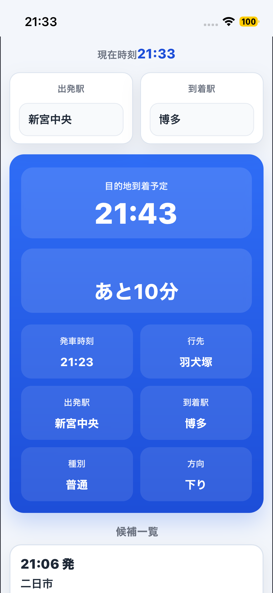
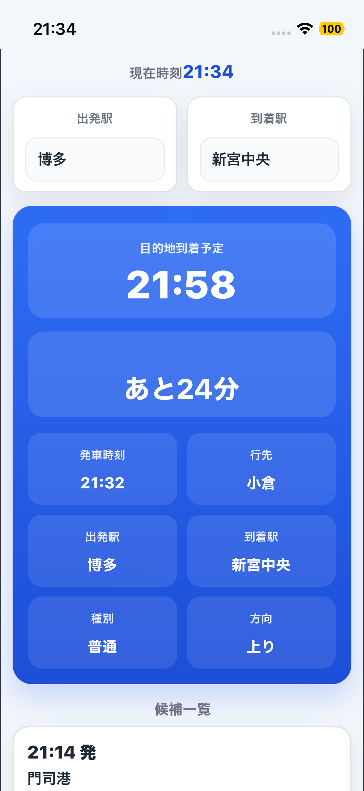

# commute_app — 通勤時の到着時刻確認アプリ

[出勤用を開く（morning）](https://ykjob.github.io/commute_app/?route=morning) · [帰宅用を開く（homecoming）](https://ykjob.github.io/commute_app/?route=evening) · [GitHubリポジトリ](https://github.com/ykjob/commute_app)

電車に乗った後、目的駅への到着時刻をすばやく確認し、スマートウォッチのアラーム設定に役立てるための個人制作Webアプリです。乗車中に「目的駅まであと何分か」を繰り返し気にしなくてもよいように、到着時刻の確認からアラーム設定までの使い方を想定しています。スマートフォンでの閲覧を前提に、到着予定時刻と到着までの時間を大きく表示します。

## スクリーンショット

出勤用morningと帰宅用homecomingを、それぞれホーム画面のショートカットから開いて使います。

| ホーム画面 | 出勤用morning（新宮中央 → 博多） | 帰宅用homecoming（博多 → 新宮中央） |
| --- | --- | --- |
|  |  |  |

## 制作背景

JRの公式アプリで到着時刻を確認する際の手間を、自分の通勤に合わせて減らしたいと考えて制作しました。乗車後に目的駅の到着時刻を確認し、その時刻をもとにスマートウォッチ側でアラームを設定することで、乗り過ごしを防ぐ使い方をしています。

自分自身の通勤ルートで使うことを想定して制作しました。現在はJR九州・鹿児島本線の同梱データに対応しており、私鉄・地下鉄・バスには対応していません。初期区間は、通勤ルートの **新宮中央駅出発 → 博多駅到着** に設定しています。

> **この公開版はポートフォリオ用のデモです。** 同梱した固定の時刻表データを使用します。実際の運行・最新ダイヤは鉄道会社の案内で確認してください。アラームは利用者がスマートウォッチ側で設定します。本アプリからの自動設定・通知は行いません。

## 試し方

1. [公開アプリ](https://ykjob.github.io/commute_app/?route=morning)を開きます。ログインやインストールは不要です。
2. 初期表示は「新宮中央 → 博多」です。別の区間を試す場合は「出発駅」「到着駅」を変更します。
3. 発車時刻・行先・種別を見て、初期選択された候補が乗車中の列車と合っているか確認します。異なる場合は「候補一覧」から選び直します。
4. 上部のカードで到着予定時刻・到着までの時間・発車時刻・行先・種別を確認します。
5. 確認した到着時刻をもとに、スマートウォッチ側でアラームを設定します。設定後はアプリを閉じます。

起動時に現在時刻付近の候補を選択しますが、実際に乗車している列車を判定する機能はありません。候補一覧で正しい列車を選んでください。同じ駅を出発駅・到着駅に指定すると案内メッセージを表示します。

## 日常の使い方：出勤用・帰宅用のURLを使い分ける

出勤時は **morning**、帰宅時は **homecoming** の画面を使います。それぞれのURLに初期プリセットを指定しているため、毎回出発駅・到着駅を選び直す必要がありません。

| 利用場面 | 画面名 | 初期区間 | URL |
| --- | --- | --- | --- |
| 出勤時 | morning | 新宮中央 → 博多 | [出勤用を開く](https://ykjob.github.io/commute_app/?route=morning) |
| 帰宅時 | homecoming | 博多 → 新宮中央 | [帰宅用を開く](https://ykjob.github.io/commute_app/?route=evening) |

実際の利用では、出勤用（morning）と帰宅用（homecoming）のURLを、それぞれスマートフォンのホーム画面にショートカットとして追加しています。出勤時・帰宅時に対応するアイコンをタップするだけで、駅を選び直さずに目的の区間を開けます。ブラウザのブックマークから開く使い方もできます。

電車に乗った後に対応するアイコンを開き、乗車している列車の到着時刻を確認して、スマートウォッチ側でアラームを設定します。これにより、電車内で目的駅までの残り時間をいちいち意識し続ける手間を減らします。

到着時刻の確認とアラームの設定を済ませたら、アプリを閉じます。画面を開いたまま残り時間を監視したり、繰り返し確認したりする使い方は想定していません。残り時間の表示は目安とし、到着予定時刻を主に使います。遅延がある場合は、車内アナウンスなどで案内された遅延時間に合わせて、スマートウォッチ側のアラームを調整します。

データの読み込み後、その区間の現在時刻付近の候補と、初期選択された列車の到着情報が表示されるので、見たい情報をすぐに確認できます。実際に乗っている列車が異なる場合は、候補一覧から選び直します。

帰宅用の画面表示名は `homecoming`、URLの指定値は `route=evening` です。有効なプリセットをURLで指定すると、保存済みのプリセットより優先してその区間を表示します。パラメータを付けずに開いた場合、保存済みの有効なプリセットがあればその区間を復元し、なければ「新宮中央 → 博多」を表示します。

## 主な機能

- 出発駅・到着駅の選択と、両駅に停車する直通列車の抽出
- 発車時刻順に並んだ現在時刻付近の列車候補の表示・選択
- 選択した列車の到着時刻・到着までの時間・列車情報の表示
- 出勤用・帰宅用のURLによるプリセット区間の呼び出しと、そのプリセットの端末内保存
- スマートフォン向けのカード表示。デスクトップでも内容を最大560px幅に収めて表示

## 本人の担当範囲

職業訓練の中間制作として個人で制作しました。企画・仕様整理・画面構成・動作確認・改善方針の決定・公開・成果発表を担当し、実装コードの作成・修正には生成AIの支援を利用しました。

| 項目 | 本人が担当した内容 |
| --- | --- |
| 企画・利用設計 | JR公式アプリでの到着時刻確認に感じた不便を制作課題として整理し、乗車後に到着時刻を確認してスマートウォッチ側でアラームを設定する利用フローを決定 |
| 仕様・画面構成 | 必要な機能と優先順位、表示する情報、画面構成を検討。生成AIの提案を採用するかどうかを判断 |
| 通勤時の使い方 | 新宮中央 → 博多の出勤用morning、博多 → 新宮中央の帰宅用homecomingを、それぞれホーム画面のショートカットから開く運用 |
| 動作確認・改善 | ブラウザやスマートフォンで実際に操作して表示・動作を確認し、意図と異なる点を整理して修正を依頼。修正後の結果を確認し、改善方針を決定 |
| ソース管理・公開 | Git・GitHubを自身で操作し、自宅と訓練校のPC間の同期、ソース管理、GitHub Pagesへの公開作業を実施 |
| 発表 | 中間制作の成果を整理し、発表を実施 |

## 生成AIの利用

制作時はChatGPTを、仕様の整理、実装コードの作成、エラー原因の調査、修正方法の相談に利用しました。

具体的には、Reactの画面、CSVの読み込み、列車候補の抽出、Pythonによる時刻表取得などについて、コードや修正案の提示を受けながら進めました。制作中には、CSV読み込み、時刻表ページのHTML構造・文字コード、逆方向の列車が候補に混在する問題などを確認し、生成AIと相談して修正を進めました。

何を作るか、どの機能を優先するか、提案を採用するかは本人が判断し、実行結果や実際の操作を確認しながら制作しました。すべてのコードを自力で記述したという意味ではなく、生成AIを活用して、課題設定から動作確認・改善・公開までを経験した作品です。

## 実装のポイント

駅・列車・停車時刻を3種類のCSVに分け、列車IDで対応づけています。同じ列車が両駅に停車し、出発駅が到着駅より先の停車順であることを確認して、逆方向の列車を除外します。

サーバーやログイン機能を設けず、ブラウザ内でCSVの読み込みと候補計算を行う構成です。Viteの公開パスをGitHub Pagesのサブディレクトリに合わせ、CSVも同じ公開パスから読み込みます。

## 技術構成

| 用途 | 技術 |
| --- | --- |
| 画面・状態管理 | React 19 / JavaScript |
| 開発・ビルド | Vite 8 |
| 表示 | CSS / レスポンシブレイアウト |
| 時刻表データ | CSV |
| CSV生成用の補助スクリプト | Python / Requests / Beautiful Soup |
| 公開 | GitHub Pages / GitHub Actions |

## ローカルでの起動

Node.js 20.19以上の20系、または22.12以上の22系など、[Vite 8が対応するNode.js](https://vite.dev/guide/#scaffolding-your-first-vite-project)とnpmを使用します。

```sh
git clone https://github.com/ykjob/commute_app.git
cd commute_app
npm ci
npm run dev
```

開発サーバーのURLは端末に表示されます。公開用ビルドとローカル確認は次のとおりです。

```sh
npm run build
npm run preview
```

GitHub Pages向けの基準パスは `/commute_app/` です。プレビュー時もこのパスで開きます。コードの静的チェックには `npm run lint` を使用します。

## リポジトリの構成

```text
src/App.jsx                 駅選択・列車候補・到着情報の画面
src/App.css                 画面レイアウト
src/data/candidateUtils.js  列車候補の生成・初期候補の選択
src/data/csvUtils.js        公開パスを考慮したCSV読み込み
src/data/presetRoutes.js    プリセット区間
public/data/               駅・列車・停車時刻のCSV
scraper/                   CSV生成用の補助スクリプト
.github/workflows/         GitHub Pagesへの公開処理
```

`main` へのpush時に、GitHub Actionsが依存関係の導入・ビルド・GitHub Pagesへのデプロイを行います。Web画面の起動にスクレイピングの実行は不要です。

## データと現在の制限

- 駅データは鹿児島本線の門司港〜荒尾を含みます。普通・快速・区間快速の同梱データに含まれる直通列車が対象です。乗換検索や全列車の網羅は行いません。
- データ生成用スクリプトの取得対象日は **2026年3月27日** です。CSV自体には取得日・適用日が記録されておらず、最新ダイヤとの一致は保証できません。曜日・休日・運転日の判定、遅延・運休情報の取得、自動更新は未実装です。
- データ生成元は[JR九州の時刻表サイト](https://www.jrkyushu-timetable.jp/)です。非公式の個人制作物です。リポジトリ内に時刻表データの再配布許諾を示す記録はありません。データの再利用・再配布時には元サイトの利用条件を別途確認してください。
- 到着までの時間は初期読み込み・駅選択時点の目安です。時間経過に合わせたカウントダウンは行いません。到着予定時刻を確認してアラームを設定し、アプリを閉じる利用を想定しています。
- 同一区間の最終列車が出た後に、朝の列車が候補として表示される問題があります。翌日の列車案内としては使用しないでください。
- 時刻の計算には端末のローカル時刻を使います。日本時間に設定した端末を想定しています。
- GPSによる位置判定、バックグラウンド通知、アラーム、オフライン対応は未実装です。

## 保存する情報

最後に使った有効なプリセットの識別子を、ブラウザの `localStorage` に保存します。手動で選んだ任意の駅の組合せを保存する機能はありません。アプリの実装には、位置情報の取得、利用者アカウント、選択区間を外部へ送信する処理を設けていません。

## 今後の改善候補

- デモデータの適用日・出典・利用条件の明記と、曜日別データへの対応
- プリセット名の一般化と、重複した駅データの整理
